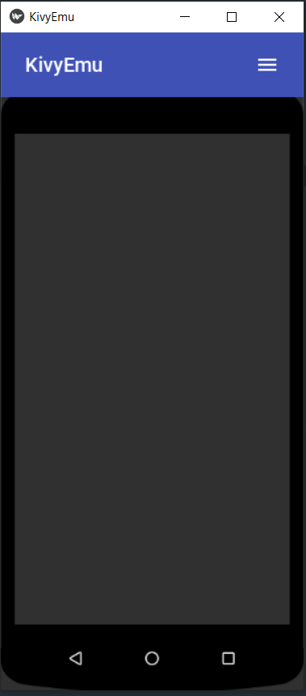
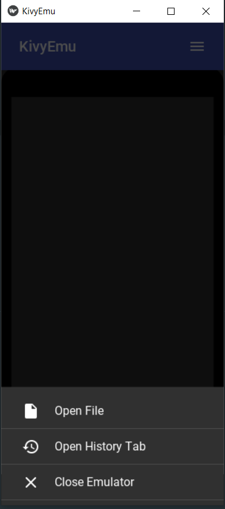
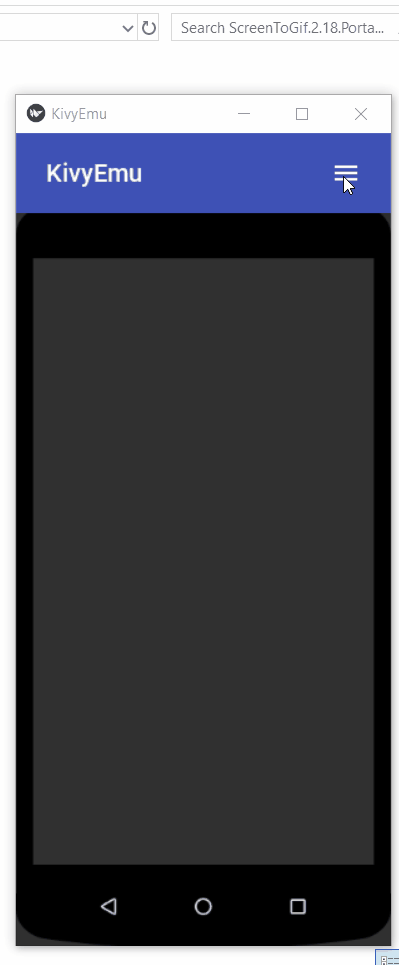

<!--
*** Thanks for checking out this README Template. If you have a suggestion that would
*** make this better, please fork the repo and create a pull request or simply open
*** an issue with the tag "enhancement".
*** Thanks again! Now go create something AMAZING! :D
-->


<!-- PROJECT LOGO -->
<br />
    <p>
    <a href="">
    
    
    
  </a>
    </p>

  <h3 align="center">KivyLiteEmulator</h3>

  <p align="center">
    An Lite Emulator for Kivy Hot Reloading
    <br />
    <a href="https://youtu.be/DIrewMibLAc"><strong>Demo Video »</strong></a>
    <br />
    <br />
 
   
</p>


<!-- ABOUT THE PROJECT -->
## About The Project

Kivy is an awesome framework for creating GUI apps. However it lacks one of the most sought after features of a GUI framework which is an 
autoreloader. We are currently working on a kivystudio but i feel i dont need another editor to write my codes in, i just need something
to display my UI in realtime.

This currently works with some of the apps i have created, it seems it is scared of bigger projects,:smile: lol,

You may also suggest changes by forking this repo and creating a pull request or opening an issue.

A list of commonly used resources that I find helpful are listed in the acknowledgements.


<!-- GETTING STARTED -->
## Getting Started

This is an example of how you may give instructions on setting up your project locally.
To get a local copy up and running follow these simple example steps.

### Prerequisites

This is an example of how to list things you need to use the software and how to install them.  I Hope you already have `kivy` installed

```sh
pip install monotonic watchdog plyer
```

### Installation


1. Clone the repo
```sh
git clone https:://github.com/mcroni/KivyLiteEmulator.git
```
3. Change Dir into the Cloned Repo
```sh
cd KivyLiteEmulator
```
3. Set `DEBUG=True` in the `OS` Environ
```sh
set DEBUG = True
```
4. Run the `main.py` file and select a python file containing your kivy codes to run
```sh
python main.py
```


<!-- CONTRIBUTING -->
## Contributing

Contributions are what make the open source community such an amazing place to be learn, inspire, and create. Any contributions you make are **greatly appreciated**.

1. Fork the Project
2. Create your Feature Branch 
3. Commit your Changes 
4. Push to the Branch 
5. Open a Pull Request


<!-- LICENSE -->
## License

Distributed under the MIT License. See `LICENSE` for more information.


<!-- CONTACT -->
## Contact

Your Name - [@kojo_mcroni](https://twitter.com/kojo_mcroni) - joeydanieldarko@gmail.com


<!-- ACKNOWLEDGEMENTS -->
## Acknowledgements
* [Kaki By Tito](https://github.com/tito/kaki)
* [KivyStudio](https://github.com/avour/kivystudio)
* [KivyMD](https://github.com/HeaTTheatR/KivyMD)
* [Kivy](https://kivy.org)
* [Cruor99](https://github.com/cruor99)


